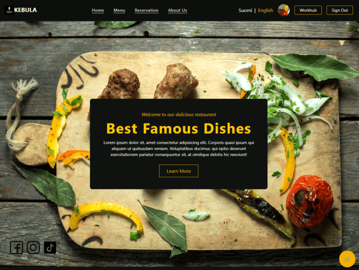

# 🍽️ Web Project

This project is part of the Web-Project course. The goal is to create a functional restaurant web application that allows users to manage reservations, orders, and menus. The application aims to handle data inconsistencies and errors gracefully while providing a user-friendly interface.

## 💡 What the Project Does

This is a comprehensive restaurant management frontend application that allows users to:

- Order food and make reservations.
- Non-registered users can also make reservations.
- Admins can add menu items and manage the application through a dedicated WorkHub view.
- The WorkHub view provides an overview of all orders, reservations, and user information.

## 🤔 Why the Project is Useful

The project simplifies restaurant operations by digitizing key processes such as reservations, menu management, and order handling. It enhances customer satisfaction by providing a seamless and efficient experience.

## ✨ Application Features

- User registration and login
- Menu management (add, edit, delete items)
- Reservation management (available for both users and non-users)
- Order management and history
- Shopping cart management
- Multilingual user interface
- Payment transaction management (successful and canceled payments)
- Admin WorkHub view for managing orders, reservations, and user information

## 🎥 Demo

To view a local/internal demo (VPN required):

1. Connect to the school's VPN.
2. Open your browser and go to:
   [http://10.120.32.87/](http://10.120.32.87/)

## 🚀 How to Get Started

### 🛠️ Installation

1. Clone or download the project source code.
2. Ensure you have Node.js and npm installed.
3. Run `npm install` to install dependencies.
4. Start the application with `npm run dev`.
5. Open the local development URL shown in the terminal.

### 🧪 Testing the App

1. Launch with `npm run dev`.
2. Open your browser and interact with the app:
   - Register/login
   - Add items to cart, place an order
   - Manage the menu (admin)
   - Make and view reservations
   - Switch languages
   - Review orders and reservations in the WorkHub (admin)

### ⚙️ Backend Repository

 [Backend](https://github.com/JarkkoKarki/Web-Project-Backend)
